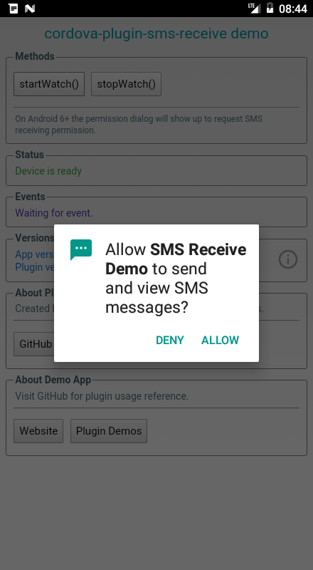
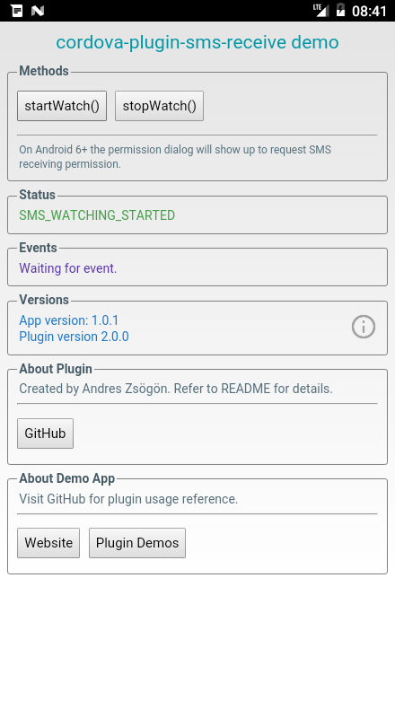
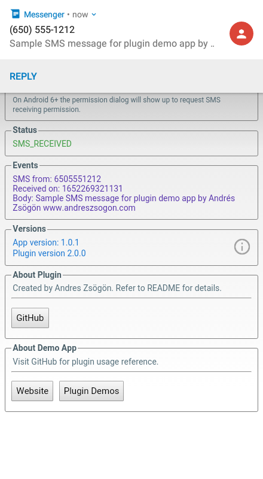

  [](https://www.paypal.com/cgi-bin/webscr?cmd=_s-xclick&hosted_button_id=G33QACCVKYD7U)

# cordova-plugin-sms-receive

Cordova plugin to get received SMS contents in Android platform.

# Installation

Add the plugin from NPM:
```bash
cordova plugin add cordova-plugin-sms-receive
```

# Methods

## startWatch

Start listening for incoming SMS messages. This will request SMS permission to the user if not yet granted.

:warning:  Method moved from **window** to **cordova.plugins** object in version 2.0.0

### Success callback return values

- **SMS_WATCHING_STARTED**
- **SMS_WATCHING_ALREADY_STARTED**

### Error callback return values

- **PERMISSION_DENIED**: User declined the permission request.
- **SMS_EQUALS_NULL**: Triggered after watching started OK but plugin failed to read the received SMS.

On Android 5.1 the SMS permission will be granted by default.

### Example

```javascript
cordova.plugins.SMSReceive.startWatch(function(strSuccess) {
	console.log(strSuccess);
}, function(strError) {
	console.warn(strError);
});
```

## stopWatch

Stops listening for incoming SMS. Always invoke this method after you have received the required SMS to [prevent memory leaks](https://stackoverflow.com/questions/41139537/why-not-doing-unregisterreceiverbroadcastreceiver-while-destroy-the-activity-w).

### Success callback return values

- **SMS_WATCHING_STOPPED**

### Example

```javascript
cordova.plugins.SMSReceive.stopWatch(function(strSuccess) {
	console.log(strSuccess);
}, function(strError) {
	console.warn(strError);
});
```

# Events

## onSMSArrive

Triggered when a new SMS has arrived. You need call **startWatch** first.

:warning:  JSON SMS payload moved from **message.data** to **message** object in version 2.0.0

### Remarks

Whenever an error ocurrs with the SMS reading/parsing process, the errorCallback from **startWatch** will trigger to return the corresponding error. The **onSMSArrive** event only triggers for correctly received messages and does not return errors.

### Example

```javascript
document.addEventListener('onSMSArrive', function(message) {
	console.log('address:' + message.address);
	console.log('body:' + message.body);
	console.log('date' + message.date)
});
```

# Plugin demo app

You can download the compiled [SMS Receive plugin demo](https://www.andreszsogon.com/cordova-sms-receive-plugin-demo/ "plugin demo app") app and inspect the source code in my [plugin demos repository](https://github.com/andreszs/cordova-plugin-demos "plugin demos repository").

  

# FAQ

### Can the SMS be intercepted and deleted?

This plugin does not send SMS nor *intercept* incoming SMS: the intercepting feature has been removed in Android 5 or earlier for security concerns, so no plugin can do this anymore.

### Does the plugin still work with the app minimized?

When the app is sent to the background, as long as Android has not unloaded it to recover memory, SMS watching will remain active and working correctly.

### Android Permissions Request

The **startWatch** method will cause the Android 6.0 and higher permission dialog to show up with this message:

> Allow [AppName] to send and view SMS messages?

This message is not exactly accurate, because the plugin only requests permission for **receiving SMS** as follows:

    <uses-permission android:name="android.permission.RECEIVE_SMS" />

### How this plugin has been tested?

This plugin has been successfully tested in devices and emulators ranging from Android 5.1 to Android 10.

# Contributing

If you find any bugs or want to improve the plugin, kindle subtmit a **PR** and it will be merged as soon as possible.

Even if you don't quite understand Java, you can investigate and locate issues with the plugin code by opening the **SMSReceive.java** file and browsing StackOverflow or the Android APIs documentation with the proper keywords.

# Changelog

### 2.0.0
- :warning: Methods moved from the global **window** to the **cordova.plugins** object.
- :warning: **onSMSArrive** no longer returns result in the **message.data** object, use **message** directly
- Fixed SMS message body, now returns the entire message without 154 chars limit.
- Fixed error when trying to start SMS watching when already active.
- Changed the **onSMSArrive** invoking method internally to use native PluginResult callback.
- Removed the SMS service center number from the JSON payload.
- Improved all methods return values to make them easier to parse.
- Improved error handling.
- Updated demo app, now available as pre-compiled APK.
