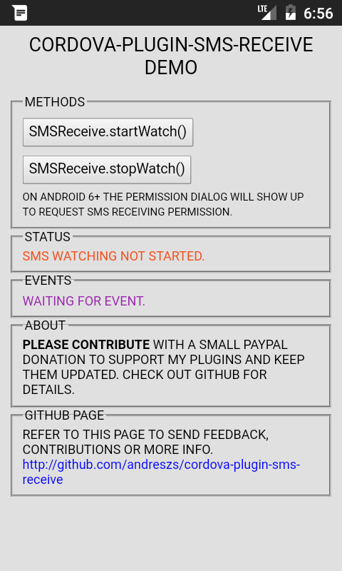
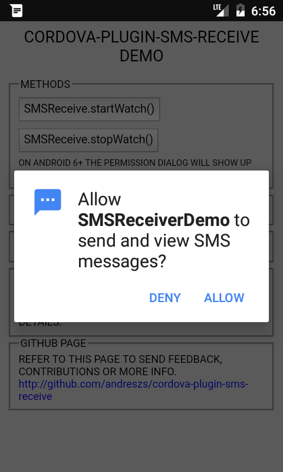
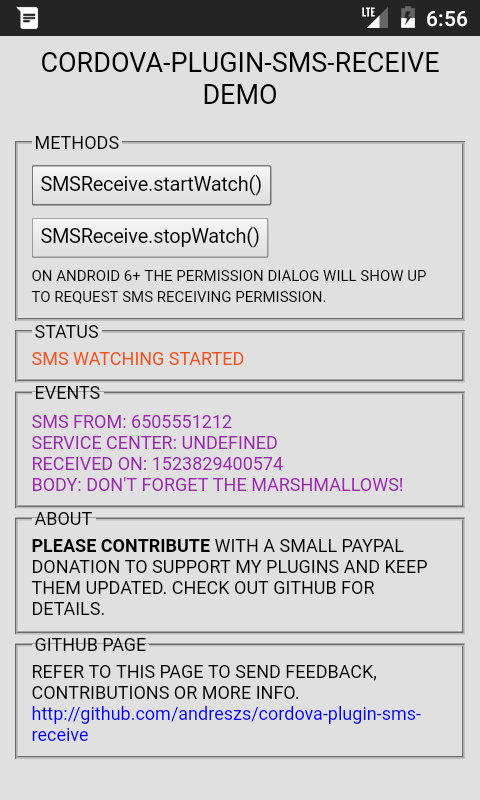

| License | Platform | Contribute |
| --- | --- | --- |
|  |  | [](https://www.paypal.com/cgi-bin/webscr?cmd=_s-xclick&hosted_button_id=G33QACCVKYD7U) |

# cordova-plugin-sms-receive

Cordova plugin to get received SMS contents in Android platform.

## Installation

Use the plugin with Cordova CLI (v6.x or above):
```bash
cordova plugin add cordova-plugin-sms-receive
```

## Methods

```javascript
SMSReceive.startWatch(successCallback, failureCallback);
SMSReceive.stopWatch(successCallback, failureCallback);
```
### SMSReceive.startWatch(successCallback, failureCallback)

Start listening for incoming SMS and raise the **onSMSArrive** event when this happens. Example usage:

```javascript
SMSReceive.startWatch(function() {
	console.log('smsreceive: watching started');
}, function() {
	console.warn('smsreceive: failed to start watching');
});
```

### SMSReceive.stopWatch(successCallback, failureCallback)

Stops listening for incoming SMS. **Important!** Always invoke this method after you have received the required SMS to [prevent memory leaks](https://stackoverflow.com/questions/41139537/why-not-doing-unregisterreceiverbroadcastreceiver-while-destroy-the-activity-w).

```javascript
SMSReceive.stopWatch(function() {
	console.log('smsreceive: watching stopped');
}, function() {
	console.warn('smsreceive: failed to stop watching');
});
```

## Events

### onSMSArrive

Triggered when a new SMS has arrived. You need call **startWatch()** first.

```javascript
/* Initialize incoming SMS event listener */
document.addEventListener('onSMSArrive', function(e) {
	console.log('onSMSArrive()');
	var IncomingSMS = e.data;
	console.log('sms.address:' + IncomingSMS.address);
	console.log('sms.body:' + IncomingSMS.body);
	/* Debug received SMS content (JSON) */
	console.log(JSON.stringify(IncomingSMS));
});
```

## Demo App

To test this plugin in a Cordova app using the provided sample:

 1. Create a blank cordova app as you regularly do.
 2. Install it using the plugin id `cordova-plugin-sms-receive`
 3. Replace your `index.html` with the one provided here at the `demo` folder
 4. Start the app in your emulator or device and test the plugin.
 5. When you are satisfied, kindly send a donation using the PayPal button on this page.

## Screenshots

Here are some screens from the **SMSReceiverDemo** sample app included in the demo folder. Feel free to try this demo in whatever device you find.







***Notice:** The previous screenshot shows an `undefined` SMS service centre number because this testing was performed in the emulator. On a real device, the correct SMS center number used to deliver the message will be shown.*

## About this Plugin

### Why this plugin has been created?

This plugin has been written based on dozens of samples around the web because **existing plugins have some issues**:

 - They request too many useless permissions
 - They are too complex, unreliable or outdated
 - They ignore the [Android 6.0 permission model](https://cordova.apache.org/docs/en/latest/guide/platforms/android/plugin.html#android-permissions)

This plugin does not send SMS nor *intercept* incoming SMS: the intercepting feature has been removed in Android 5 or earlier for security concerns, so no plugin can do this anymore.

### How this plugin has been tested?

I have tested this plugin with success on:

 - Android 4.0.3 emulator
 - Android 5.1.1 emulator
 - Android 6.0 emulator
 - Android 7.1.1 emulator
 - BLU Vivo 4 (Android 4.1.1 Jelly Bean)
 - BLU Energy Mini (Android 5.1 Lollipop)
 - BLU Vivo 5 Mini (Android 6.0 Marshmallow)
 - BLU Studio J8 (Android 7.0 Nougat)
 - Samsung Galaxy S6810 (Android 4.1.2 Jelly Bean)
 - Samsung Galaxy I9190 (Android 4.4.2 KitKat)

Yes, I know: all my phones are **deprecated or obsolete** ... If you want me to test the plugin in **Android 8+**, kindly send a generous donation to help me acquire a [Sony Xperia XZ1](https://www.gsmarena.com/sony_xperia_xz1_compact-8610.php) device. You'll also get almost-instant Email support from me if you have any questions.

### Does the plugin still work with the app minimized?

When the app is sent to the background, as long as Android has not unloaded it to recover memory, SMS watching will remain active and working correctly.

### Android 6.0+ Permissions Request

The `SMSReceive.startWatch()` method will cause the Android permission dialog to show up with this message:

> Allow [AppName] to send and view SMS messages?
> [DENY] [ALLOW]

This message is not exactly accurate, because the plugin only requests permission for **receiving SMS** as follows:

    <uses-permission android:name="android.permission.RECEIVE_SMS" />

## Contributing

Please consider contributing with a small **donation** using the PayPal button at the top if you liked this plugin and it works as expected. This will allow me to get newer, more up-to-date phones to test my work.

For support, you may post in the **Issues** section. Be aware that I don't have much time for dealing with Java and the Android APIs, so before you start complaining that *X does not work*, make sure to compare the plugin behavior across different devices and emulators in order to locate the exact source of the problem.

Even if you don't quite understand Java, you can investigate and locate issues with the plugin code by opening the **SMSReceive.java** file and browsing StackOverflow or the Android APIs documentation with the proper keywords.

## How to post Issues

If you are convinced that the plugin needs to be fixed / updated, kindly **post your issue in full detail**, including Android version, device brand and name, Cordova and cordova-android versions.

Please don't expect me to instantly reply with a magical solution or a new plugin version, but I'll try to help in whatever I can. I'm interested in mantaining this plugin in a working condition, so try to send useful, constructive feedback whenever possible.

